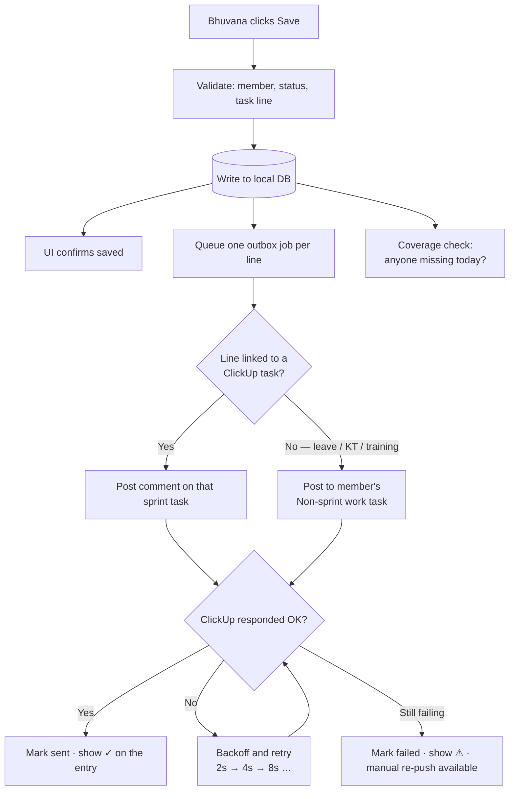

# Daily Status Tracker — Functionality & Flow

What the tool does, in the order it gets used. Read §1 for the flow, §2 for the
feature list, §3 for what is deliberately excluded.

---

## 1. The daily flow

### 1.1 Who does what

| Time (IST) | Who | What |
|---|---|---|
| ~9:00 | Bhuvana | Opens **Daily Entry**. Grid is already pre-filled from yesterday. |
| 9:15–10:00 | Team | Standup call. Bhuvana updates each person's line as they speak. |
| ~10:00 | Bhuvana | One **Save**. Everything commits locally, ClickUp push queues. |
| 10:00+ | Anyone | **Today's Standup** is the shareable record. Blockers visible with age. |
| Continuous | System | Outbox worker posts comments to ClickUp, retries on failure. |

### 1.2 What happens on Save



**The important property:** step C succeeds before any ClickUp call is attempted.
If ClickUp is down, slow, or the token is wrong, **the standup is still recorded**.
The push catches up on its own. Nothing is ever lost waiting on an external API.

### 1.3 What a single entry looks like

One member on one day produces one or more **lines**:

```
19-Jun-2026 · Rishi · P1: PPS
  ├── line 1 → ClickUp task "Chatbot deployment"        · Done        · "git pushed"
  └── line 2 → ClickUp task "PPS Refinement"            · In Progress · ""

19-Jun-2026 · Thabu Priya · (no project)
  └── line 1 → Non-sprint work — Thabu Priya            · In Progress · "Training — git code checking"

19-Jun-2026 · Chandhru
  └── line 1 → Non-sprint work — Chandhru               · On Leave    · ""
```

Multiple lines exist because the current sheet already works this way — entries
like *"Prototype Phase 2 + SEO Agent task"* are two work items sharing one cell.

---

## 2. Functionality

### A. Daily capture — Bhuvana's screen

| # | Function | Why |
|---|---|---|
| A1 | **One grid, all active members** as rows | Matches how she works today: one screen, one pass, no navigation |
| A2 | **Carry-forward pre-fill** from the last working day | Most days a person continues the same task. Pre-filling makes the common case a single dropdown change |
| A3 | **Multiple lines per member** | A person's day often covers 2–3 tasks (§1.3) |
| A4 | **ClickUp task picker**, scoped to that member's sprint tasks | Turns "type the task name" into "pick the task". This is what makes the ClickUp link reliable — an exact reference chosen by a human, not a fuzzy match |
| A5 | **Non-sprint work bucket** | Leave, KT, training, onboarding — 28% of current entries. Captured, not dropped |
| A6 | **Status dropdown** (fixed vocabulary) | Kills the free-text problem: today's sheet has `completed`/`In Progress`/`In Review`/`Hold`/`on leave` and a `Staus` typo, against a legend that says something else entirely |
| A7 | **Comment field** per line | Optional context — used in ~40% of rows today |
| A8 | **Single Save** for the whole team | One action ends the meeting |
| A9 | **Weekend / holiday aware** | Sat & Sun skipped automatically |
| A10 | **Edit past days** | Corrections after the fact, with an audit trail of who changed what |

**Target: under 3 minutes** for all 9 people.

### B. Blockers

| # | Function | Why |
|---|---|---|
| B1 | **Raise a blocker** with description, *affected* person, and *owner* | The current sheet conflates these — a blocker about Yogaram is recorded on Bhuvana's and Karthick's rows. Separate fields fix the misattribution |
| B2 | **Blocker board** with **age in days** | Age is the number that drives action. Invisible today |
| B3 | **Resolve / close** with date | Gives cycle time, and stops stale blockers repeating in the meeting |
| B4 | **Push to ClickUp** as a real task assigned to the owner | A blocker with an assignee gets chased; a text cell does not |

### C. Reading and reporting

| # | Function | Why |
|---|---|---|
| C1 | **Today's Standup** — read-only, grouped by project, blockers pinned top | The screen you project during the 9:15 call. Replaces reading the sheet aloud |
| C2 | **Person view** — one member across the sprint | "What has X been doing" — for 1:1s and reviews |
| C3 | **Project view** — status by project | Which project is moving, which is stuck |
| C4 | **Coverage** — who has no entry today | Today a blank row and a quiet day look identical. This makes gaps visible |
| C5 | **Sprint rollup** — entries logged, status mix, open blockers, days lost to leave | Replaces the Overview tab. No hours, no efficiency |
| C6 | **History & search** — by person, project, date range, free text | Answers "when did we first hit this problem" |
| C7 | **Export** — copy today's standup as text/markdown | For pasting into chat or email |

### D. ClickUp integration

| # | Function | Why |
|---|---|---|
| D1 | **Status posted as a comment on the real sprint task** | Your chosen model — progress lives on the work item |
| D2 | **Idempotent writes** — re-pushing edits the existing comment | Keyed on `(date, member, task)` via a hidden marker. Re-running is always safe, never duplicates |
| D3 | **Outbox with retry + backoff**, honours HTTP 429 | Nothing is lost if ClickUp is unavailable |
| D4 | **Per-entry sync indicator** — pending / sent / failed | You can always see whether ClickUp actually has it |
| D5 | **Manual re-push** for failed entries | One button, no engineer needed |
| D6 | **Nightly reconciliation** — compare local vs ClickUp, report drift | Silent divergence is what destroys trust in a mirror |
| D7 | Optional: update `Latest Status` / `Blocked` custom fields on the task | Current state visible without opening the comment thread |

### E. Setup & admin

| # | Function | Why |
|---|---|---|
| E1 | **Member registry** with aliases and active flag | Resolves `Anandh` / `Ananth` / `Anandharaj` → one person; handles joiners like Thabu Priya (16-Jun) |
| E2 | **Project registry** mapped to ClickUp lists | P1 PPS, P2 SSO, P3 H&C, P4 Vitabea, P5 CCH |
| E3 | **Sprint definition** — one authoritative start/end | The sheet currently carries four conflicting ranges |
| E4 | **Status vocabulary** — `Not Started · In Progress · In Review · Done · On Hold · Blocked · On Leave` | One list, enforced by the dropdown |
| E5 | **One-time backfill** of the 60 existing sheet rows | Keeps history; the sheet then goes read-only |

---

## 3. Deliberately excluded

Per the requirement to drop time and efficiency reporting entirely:

- ❌ Time tracked / hours logged
- ❌ Estimated vs actual, variance, over-budget flags
- ❌ Efficiency scores and grades
- ❌ Velocity, story points, burndown

> The efficiency metric was also misleading on its own terms — it capped at 100,
> so someone at 39h-vs-35h and someone at 23h-vs-9.5h scored identically.
> Removing it resolves that rather than needing a fix.

**Attendance is kept** (`On Leave`), because it explains gaps — but it is excluded
from status-mix charts, otherwise leave dilutes the team's progress picture.

---

## 4. Workspace confirmation

**Is `9013992885` the right workspace? Yes.** The sheet contains
`app.clickup.com/9013992885/v/dc/8cmd7dn-95313/8cmd7dn-51793` — a live ClickUp
Doc under that workspace, referenced as the PPS user-story/usecase document from
the US team. That is direct evidence it is the team's real workspace.

**What is still unverified: what is inside it.** Direct API access is blocked by
this environment's egress policy, and the ClickUp account reachable from this
session is a different workspace (`9016902951` — placeholder spaces, no folders,
two members, none of them on the scrum team).

One measurement worth weighing before committing to §D1. Across the whole
workbook:

| Tool | Links referenced |
|---|---|
| Google Sheets | **11** |
| ClickUp | **1** (and it is a Doc, not a task) |
| Figma | 1 |

Every operational tracker the team actually uses is a Google Sheet. So the open
question is not *which* workspace, it is **whether the sprint tasks exist in
ClickUp as tasks at all** — because D1 posts comments onto them.

Run `npm run verify` from any machine with normal internet access. It prints every
workspace, folder and list the token can see and settles this immediately.
